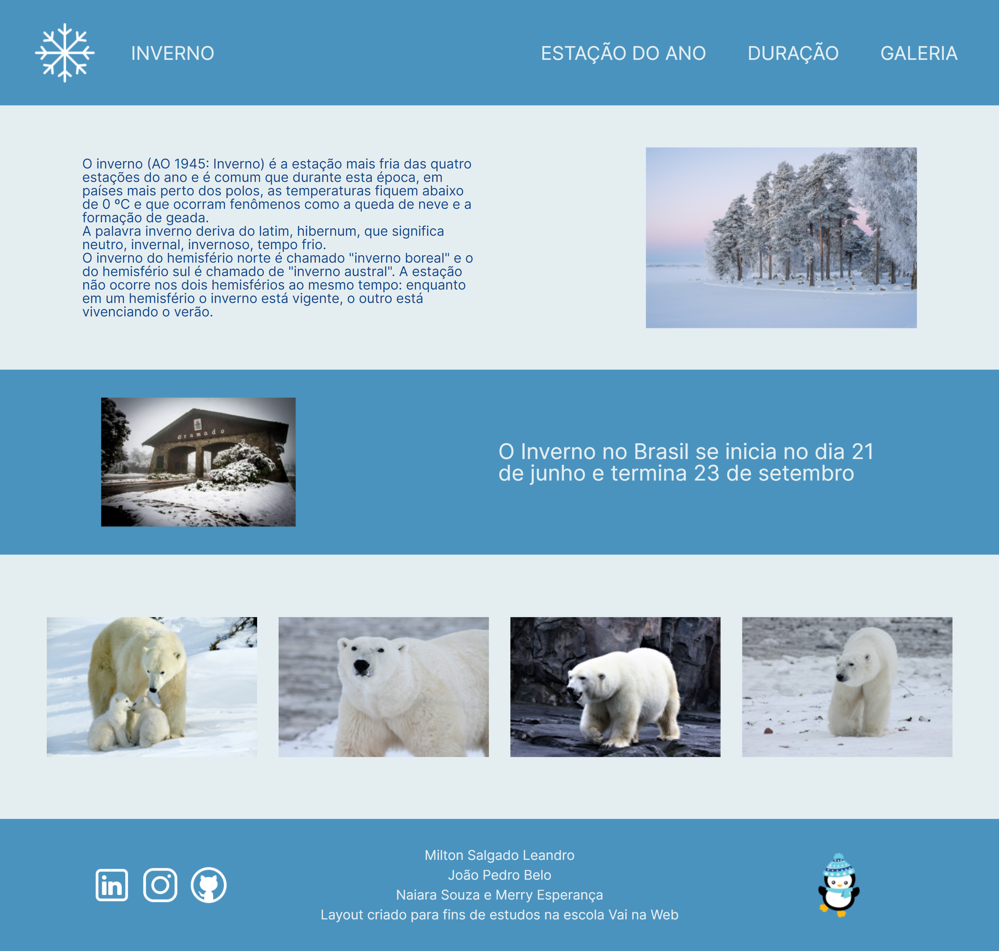

# ❄️ Winter

Uma "landing page" sobre o inverno.

## 📚 Tabela de Conteúdos

- [❄️ Winter](#️-winter)
  - [📚 Tabela de Conteúdos](#-tabela-de-conteúdos)
  - [📋 Descrição](#-descrição)
    - [🚀 Funcionalidades](#-funcionalidades)
    - [🌐 Acesso](#-acesso)
    - [📸 Prévia](#-prévia)
  - [⚙️ Construção](#️-construção)
    - [💻 Tecnologias](#-tecnologias)
    - [🛠️ Ferramentas](#️-ferramentas)
    - [📌 Versão](#-versão)
  - [✏️ Aprendizado](#️-aprendizado)
  - [✒️ Autores](#️-autores)
  - [🎁 Agradecimentos](#-agradecimentos)
  - [📨 Contato](#-contato)

## 📋 Descrição

Este é um projeto de uma "landing page" sobre o inverno.
Esse projeto foi disponibilizado na segunda aula prática de flexbox do curso "Vai na Web" e também foi lançado como o desafio 03, e tinha como proposta a utilização do flexbox como a única ferramenta de espaçamento dos elementos de uma página em HTML, sem a utilização de nenhum outro mecanismo de espaçamento, como "padding" e "margin". O modelo a ser seguido foi apresentado na plataforma de design "Figma". 

### 🚀 Funcionalidades

As funcionalidades disponíveis para os usuários estão listadas abaixo:

- Utilizar um cursor especial de um urso polar no inverno
- Alterar a espessura de fonte dos itens da barra de navegação ao passar com o cursor do mouse por cima
- Visualizar uma galeria de ursos polares
- Obter informações relevantes sobre a estação mais fria do ano

### 🌐 Acesso

🖇️ [Clique aqui para acessar o projeto](https://milton-salgado.github.io/winter/)

### 📸 Prévia

## ⚙️ Construção

Resumo geral dos recursos utilizados na construção do projeto.

### 💻 Tecnologias

Tecnologias utilizadas na construção do projeto:

### 🛠️ Ferramentas

Ferramentas utilizadas na construção do projeto:

### 📌 Versão

Utilizei o Git para o controle de versão. 

Versão atual: 1.0 (primeira versão)

## ✏️ Aprendizado

Ao fazer esse projeto, aprendi a:

- Dominar propriedades do flexbox
- Editar imagens para melhorar o uso e visualização na página
- Utilizar vários valores das propriedades de flexbox "justify-content" e "align-items"
- Utilizar a propriedade "flex-direction" para direcionar os elementos de uma caixa pai com flexbox
- Controlar melhor espaçamentos

## ✒️ Autores

* **Milton Salgado Leandro** - *Todo o Projeto* - [GitHub](https://github.com/milton-salgado)

## 🎁 Agradecimentos

* Agradeço ao instrutor João Pedro Belo e aos facilitadores Merry Esperança e Naiara Souza pelo auxílio no meu processo de aprendizagem e apoio na construção do projeto.
* Agradeço também a você, visitante, por visualizar o meu projeto!

## 📨 Contato

